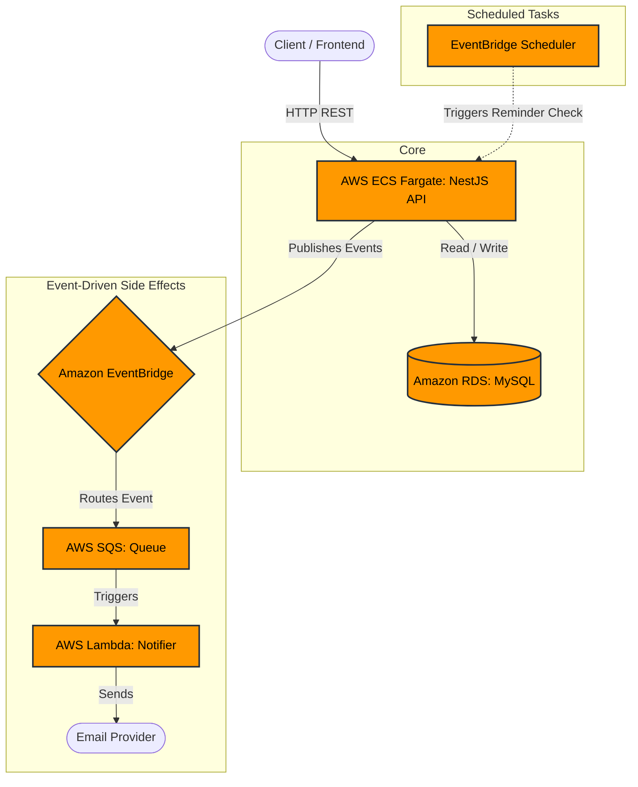

# Event-Driven Task Management System

This repository contains an event-driven task management system composed of a NestJS backend and a React frontend, built for a Senior Full-Stack assessment.

## Part 1: Architecture & System Design

### 1. High-Level AWS Architecture
* **API / Compute:** **AWS ECS (Fargate)** running Node.js containers.
* **Database:** **Amazon RDS (MySQL)**. Selected for strict relational integrity between tasks and users.
* **Event Bus:** **Amazon EventBridge**. The core of the event-driven design.
* **Background Workers:** **AWS SQS + AWS Lambda**. EventBridge routes events to SQS, triggering a Lambda to process notifications decoupled from the API.
* **Scheduler Job:** **Amazon EventBridge Scheduler** for time-based reminders.



### 2. Event-Driven Flow
* `TaskCreated` / `TaskAssigned`: Emitted on creation. A consumer sends an email notification.
* `TaskUpdated` / `TaskCompleted` / `TaskDeleted`: Emitted upon state changes to notify relevant parties.
* `TaskReminderTriggered`: Emitted by the reminder job.

### 3. Data Modelling
* **Task Entity:** `id` (UUID), `title`, `description`, `due_date`, `creator_id` (UUID), `assignee_id` (UUID), `status` (PENDING, COMPLETED), `created_at`, `updated_at`, `deleted_at`.
* **Invariants:** `COMPLETED` tasks are immutable. Queries filter out records with a `deleted_at` timestamp (Soft Deletes).

### 4. Scalability & Reliability
* **Scalability:** Stateless API containers.
* **Reliability:** SQS implementation includes a Dead Letter Queue (DLQ) for failed notification retries.

---

## Part 2: Local Setup Instructions

This project is fully containerized. No local Node.js or MySQL installation is required.

**Steps to run the system:**
1. Clone this repository and navigate to the root directory.
2. Create the environment file:
   ```bash
   cp .env.example .env
   ```
3. Start the full infrastructure (Database, API, and Web UI):
   ```bash
   docker compose up --build -d
   ```
4. Access the applications:
   * **Frontend UI::** http://localhost:5173
   * **API / Swagger Docs::** http://localhost:3000/api/v1/docs
   * **Health Check::** http://localhost:3000/api/v1/health